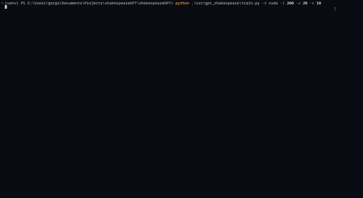
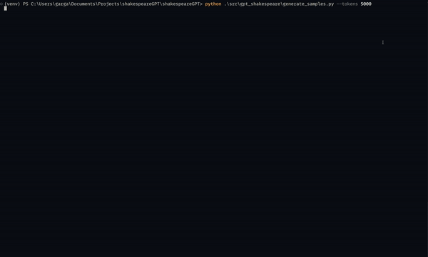

Replication of Andrej Karpathy's [*Let's Build GPT*](https://www.youtube.com/watch?v=kCc8FmEb1nY). Also used this lecture to test out [uv](https://docs.astral.sh/uv/) which was updated wih new features recently.

-------------------
## Setting up the project

Ensure that you have [uv](https://docs.astral.sh/uv/) installed. This can be installed using:

For macOS/Linux:
```bash
curl -LsSf https://astral.sh/uv/install.sh | sh
```

For Windows: 
```powershell
powershell -c "irm https://astral.sh/uv/install.ps1 | iex"
```

Then create a virtual environment and sync the project

```bash 
uv venv venv
source venv/bin/activate (for mac/linux) OR .\venv\Scripts\activate (for win)
uv pip sync
```

-------------------
## Training

To train the model run the `train.py` script using 
```bash
python3 src/gpt_shakespeare/train.py
```

The following flags/options can be passed when running the script:
```bash
USAGE:
    python3 src/gpt_shakespeare/train.py [FLAGS] [OPTIONS]

FLAGS:
    -s, --save   Save the model | When this flag is passed, ensure that the path option is also passed

OPTIONS:
    -b, --batchsize     <integer>      Batch size to train on
    -i, --iters         <integer>      The number of iterations to train on
    -e, --evalinterval  <integer>      At which interval to evaluate the model on val data
    -o, --evaliters     <integer>      How many iterations to run when evaluating model
    -l, --lr            <float>        Learning rate for the model
    -d, --device        <path>         Device on which to run the training
    -p, --path          <path>         Where to save if save flag is used
```



-------------------

# Inference

To generate samples, run the following script 
```bash
python3 src/gpt_shakespeare/generate_sample.py
```

The following options can be passed:

The following flags/options can be passed when running the script:
```bash
USAGE:
    python3 src/gpt_shakespeare/generate_samples.py [OPTIONS]

FLAGS:
    -s, --save   Save the model | When this flag is passed, ensure that the path option is also passed

OPTIONS:
    -t, --tokens     <integer>    How many tokens to generate
    -p, --path       <path>       Path where to load the weights from
```



